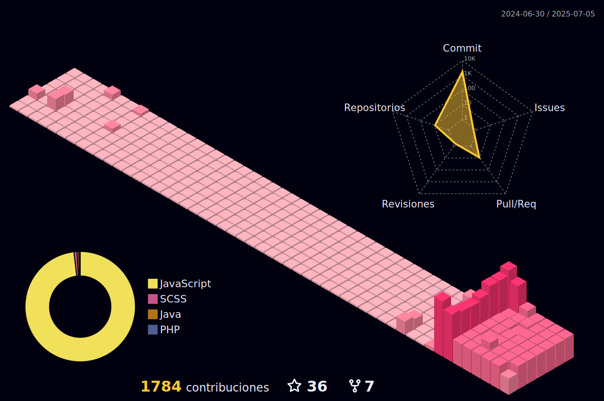

 <picture>
  <source media="(prefers-color-scheme: light)" srcset="./profile-3d-contrib/profile-green.svg">
  
 </picture>

<h1 align="center">✌️Hi! i´m Amy</h1>
<h3 align="center">An unstopable learner from Chile 📌 working towards expanding my set of skills 

 
   

 

 ⚡About Me :
  

-🌱 currently learning ** Functional programming and SSR with nextJS@14 **

-⚔️ im a firm believer that hard work and dreaming big is the key to success

-👩🏻‍💻Ask me about web development

-interested in mobile development

-🐈fun fact : i enjoy true crime documentaries , conversations about cats and a frantic tea drinker. 
  

## 📊 My Stats

